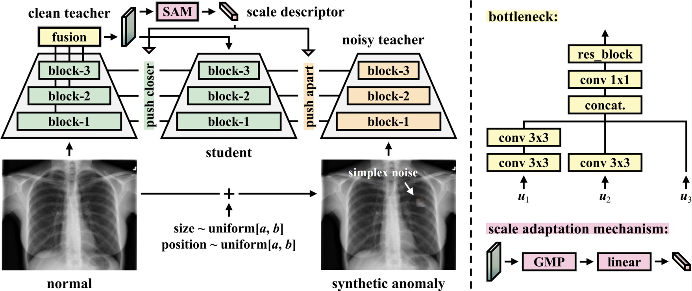

# Scale-Aware Contrastive Reverse Distillation for Unsupervised Medical Anomaly Detection

This repository contains the official implementation of **Scale-Aware Contrastive Reverse Distillation for Unsupervised Medical Anomaly Detection**, accepted by ICLR 2025.

<p align="center">
  
</p>


## Environment

The code was tested with the following package versions:

```text
torch == 1.9.1
torchvision == 0.10.1
numpy == 1.20.3
scipy == 1.7.1
scikit-learn == 1.0
Pillow == 8.3.2
```

You can create the environment with:

```bash
conda create -n scrd4ad python=3.8
conda activate scrd4ad

# Please choose the CUDA version according to your machine.
conda install pytorch==1.9.1 torchvision==0.10.1 cudatoolkit=11.1 -c pytorch -c conda-forge

pip install numpy==1.20.3 scipy==1.7.1 scikit-learn==1.0 Pillow==8.3.2
```

## Dataset

SCRD4AD is evaluated on three medical anomaly detection datasets.

**RSNA:** A chest X-ray dataset for lung opacity and pneumonia-related anomaly detection.

**Brain Tumor MRI:** A brain MRI dataset, where tumor-free slices are treated as normal and glioma/meningioma slices are treated as anomalies.

**ISIC 2018:** A dermoscopic skin lesion dataset, where nevus images are treated as normal and the remaining lesion categories are treated as anomalies.


## Training

Run the following command to train SCRD4AD on medical datasets:

```bash
python train_rsna.py --img_path /path/to/images --json_path /path/to/annotations.json --gpu 0
```

> Note: Please modify the script names and arguments according to the actual code in this repository.

## Citation

If you find this work useful, please cite:

```bibtex
@inproceedings{li2025scale,
  title={Scale-aware contrastive reverse distillation for unsupervised medical anomaly detection},
  author={Li, Chunlei and Shi, Yilei and Hu, Jingliang and Zhu, Xiaoxiang and Mou, Lichao},
  booktitle={International Conference on Learning Representations},
  year={2025}
}
```

## License

This project is released for academic research use. Please refer to the license file for more details.
